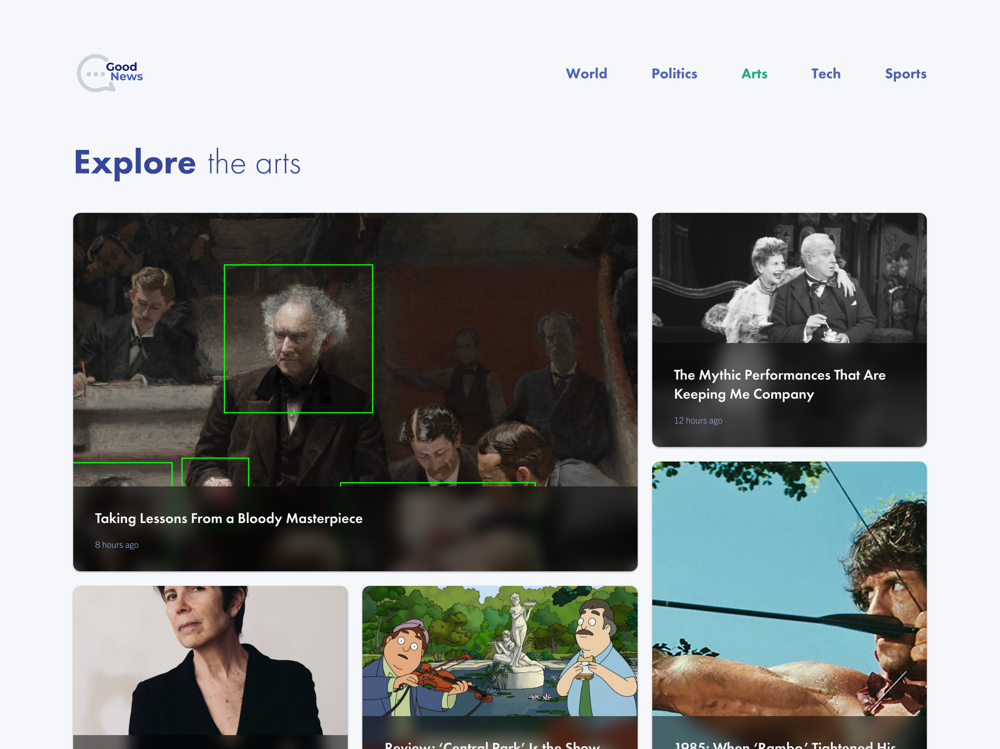

[Click here for a live demo](https://blissful-turing-9678ab.netlify.app/)

  

While this was a coding challenge, I treated this as a customer/client project. Not only is it important to have clean, quality code, but to also make design decisions that solve problems.

**Problem**

An online newspaper company called Good News wanted to update their website. Due to the Coronavirus, the company was losing subscribers and trust from their customers. Good News wanted to ensure their current customers were staying happy and continued subscribing.

Here was a list of concerns the company addressed, which were quotes from their customers:

-   "Too many articles on one page"
-   "Home page was overwhelming, confusing customers"
-   Articles felt “stacked on top of each other"
-   The fonts were difficult to read an article

**Goals**

A few goals the customer wanted to achieve:

1. Improve the design to address the main concerns.
2. Make a more modern, updated website that appealed to younger audience
3. Make the website feel like a newspaper but not too overwhelming

**Approach**

Here were some design decisions I've made to address the Goals & Problems for the customer:

-   Use Sans-serif fonts
-   Rounded borders
-   Good use of whitespace
-   Professional, friendlier color palette
-   Use of visuals (images) to display hierarchy/importance
-   Clean, Modern UI (CSS Grid) that imitated a old-school "newspaper" feel
-   Mobile Friendly
-   Articles Sections were divided up on each page (not all on one page)

**Results**

I ended up with a clean and stylish website design, good “white space” utilization and attention to detail which allow to attract the target audience in a more efficient way.

**My Philosophy**

As a Software Engineer, I have a gift that can affect people globally. Having been laid off due to the Coronavirus,this inspired me to make these design decisions to do what I can to make a company’s site better and more impactful. While this was a fictitious client project I believe we have a responsibility to make the world better a better place.

**NOTES**

While the requirements for this application stated to include multiple browser support (specifically Google Chrome and Firefox), I encountered a bug last minute that affected the Firefox browser when clicking on an article to receive article details. I take responsibility in not completing the task at 100% of what was asked.

I've identified the bug as the `location.state` object returning `undefined` when navigating to a new route while using the `forceRefresh={true}` within the React Router. All browsers work as expected but FF appears to handle this differently. I have a few solutions but would have required extensive refactoring. Given more time, I would be able to solve this issue.

To make up for Firefox (and in addition to Google Chrome), I checked Safari, Opera, Mobile Chrome, and Mobile Safari.
